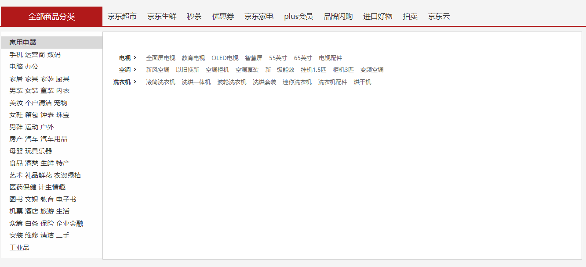
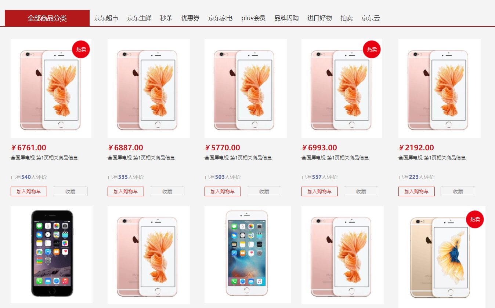
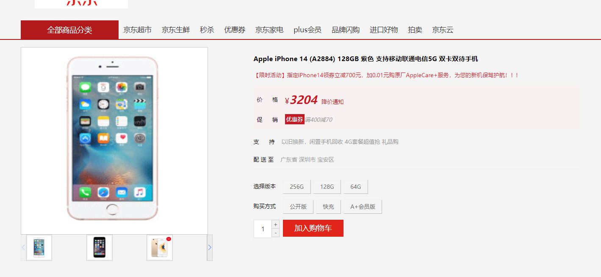
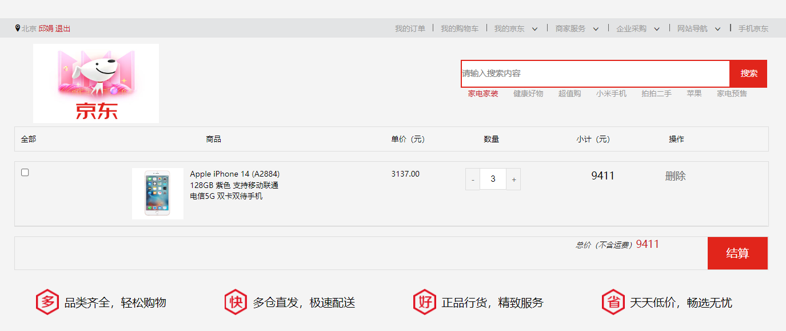

# 电商前台项目
## 项目描述
这是一个基于vue.js框架的电商项目，采用了前后端相互分离的模式。采用mock.js拦截网络请求并返回数据的方式模拟后端。用户可以完成注册，登录。并可以搜索商品，查看商品详情，加入购物车。结算商品。
## 使用技术
HTML，CSS(包含LESS), JavaScript, Vue, VueX, VueRouter, axios, Element-Ui, Swiper, mock.js
## 项目要点
1. **前后端分离,VeuX统一管理数据。** 前端中需要使用数据时，在组件中的对应位置dispatch相应的action，并在action中派发网络请求。通过mock.js模拟服务端返回特定格式的数据。返回的数据commit后，在getters中进行处理或者储存到state中。数据通过VueX统一管理。
2. **二次封装axios，统一管理api。** action中的网络请求api进行了二次封装，统一设定axios的config对象，请求拦截器和响应拦截器，方便对网络请求进行管理设置。
3. **组件化开发，提升代码复用性，多种方法灵活实现组件间通信。** 根据网页的功能分离出Header,Footer等组件，组件各自独立，可复用，减少组件间的耦合依赖。便于管理。使用单向，双向数据绑定来采集数据。综合使用事件总线，props属性，消息订阅与发布保证组件间的信息交流。
4. **VueRouter管理路由信息，构建单页面应用。** 使用导航，路由元信息，路由守卫等多种方式控制页面跳转。

## 项目展示
**电商前台项目主页**

**实现了登录和注册功能**

**能够多级联动，并根据点击商品跳转到对应搜索页**

**点击商品，搜索商品可进入详情**

**商品详情展示查看**

**购物车功能**

