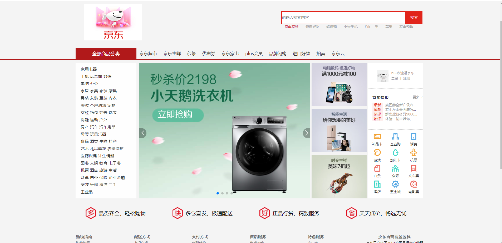

# An e-commerce front-end project used to practice front-end skills.
## Project description
这是一个基于vue.js框架的电商项目，采用了前后端相互分离的模式。采用mock.js拦截网络请求并返回数据的方式模拟后端。用户可以完成注册，登录。并可以搜索商品，查看商品详情，加入购物车。结算商品。

## Project display
**电商前台项目主页**

### Login and registration
**实现了登录和注册功能**

### Typenav
**能够多级联动，并根据点击商品跳转到对应搜索页**

### Search for goods
**点击商品，搜索商品可进入详情**

### Details for goods
**商品详情展示查看**

### ShopCar
**购物车功能**

